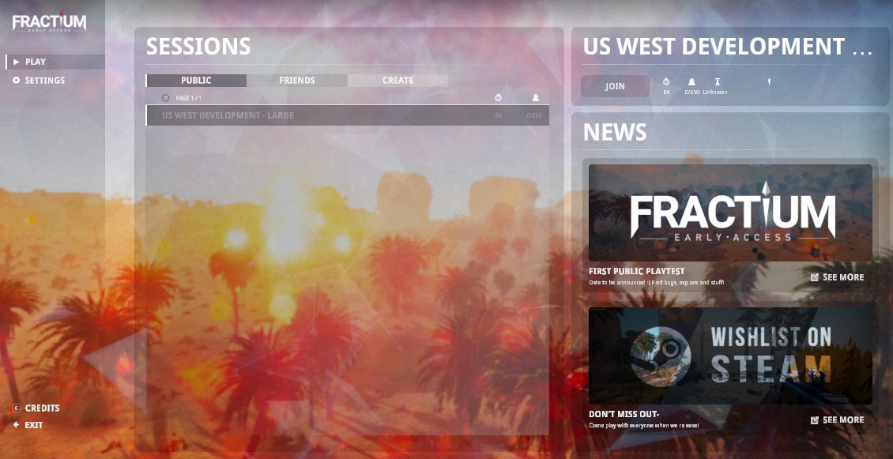
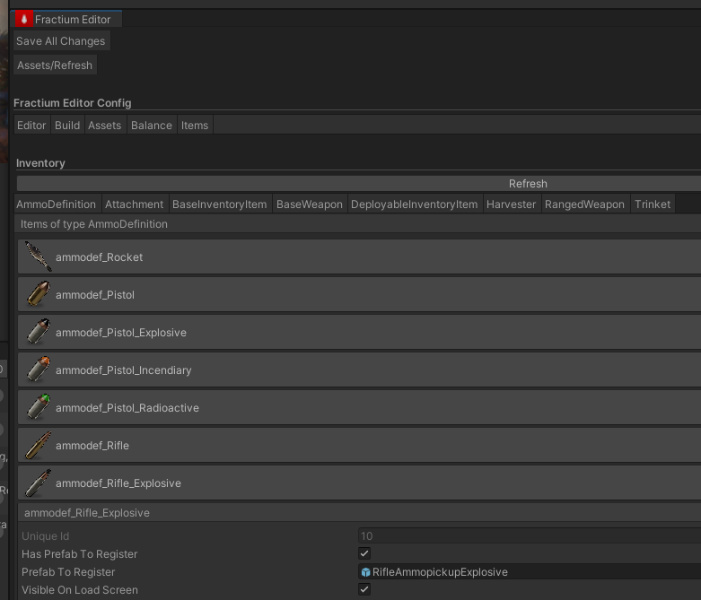
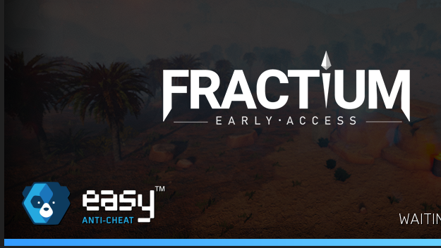
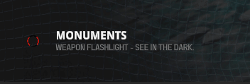
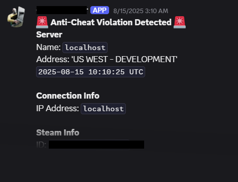
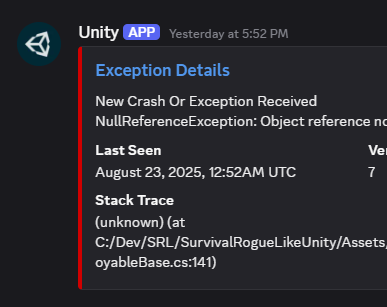
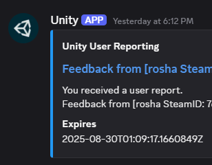
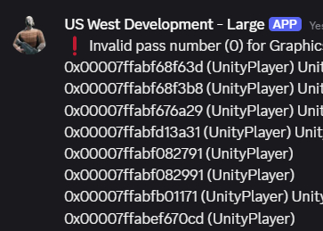

# Devblog 1
**August 23 2025**

Covers first two weeks of work on Fractium after a long break.

Fractium, once known as The Last Path, is our first person survival game that aims to create breathtaking and original social experiences. Fractium is unreleased and currently under development by twoloop games, under Aaron Frost and Rylan Krebbs.

## BACK ON TRACK
*by Aaron*

I've been hard at work brushing off dust. I won't spoil big plans yet. There's a lot in the works.

## GAME SERVERS
Fractium needs dedicated servers. Our first game server is a dedicated bare-metal at $130/mo. 128GB RAM and a decent CPU. Not bad.

I also set up CI/CD with automated setup scripts for future us and community server owners.

Working multiplayer, server browser, and PVP clips are all functioning well.

## CUSTOM EDITOR
In Unity, it's too easy to create dev workflows all over the place. We now have a unified Fractium editor tool.

This handles inventory items, balance, and builds all in one place.

## ANTI HACK
I integrated decent 3rd party anti-hack, build stripping and obfuscation. I also made good progress on setting up Epic EasyAntiCheat.

I also set up server authority on "remote" inventory access, so it validates things like line of sight and distance when you access loot containers.

## LOAD UI
I made it async and do fake spinning to show the game isn't frozen. Unfortunately some Unity things must run on the UI thread, making freezing unavoidable.

## GAMEPLAY LOOP
From a birds-eye view, the gameplay loop is now complete. You live, die, respawn, rage-quit, and do it again from scratch every few weeks, like Rust.

## DISCORD
Now, when players send feedback or their game crashes, it surfaces in our Discord channel. Also, game server admins can specify webhooks for sending logs and anti-cheat logs to.

*Exception reporting*

*Anticheat alerts*

*Server logs*

*Player feedback*

## CAM SHAKE
I added camera shake and beefier footstep sounds on this enemy.

## WHAT'S NEXT
- Stress testing (ideally 250+ bot players and 150k total entities)
- Finish up EasyAntiCheat integration
- Serialization
- Lots of bugs

## NEW TREES
*by Rylan*

Rylan made new trees.

*"SpeedTree is not affordable for small teams so TreeIt is awesome"*

More random clips coming soon!

## CHANGELOG

**8/9/2025**
- got rid of second directional light that was left enabled by accident
- get rid of tile generation (we're not using it, yet)

**8/11/2025**
- made fog color a function of time
- got rid of scoreboard indicator in map UI
- got rid of game timer and UI in map UI
- fixed unclickable spawn point UI
- fixed exit to main menu button not working in Unity editor play mode
- deleted timer gameobject and scoreboard text
- fixed issue where you can use respawn points while alive
- ensure death screen opens map

**8/12/2025**
- added server side validation on remote inventory access. validates the open method using line of sight, distance, and authority. also includes a fixed interval update check
- bug fix – you cannot consume med-kits if they are not in your inventory. This also fixed the same bug for unloading ammo/fuel from tools
- added dev option to force island biome in Fractium Editor Config window
- workflow Improvement – made flat world use main gameplay scene to share UI objects

**8/13/2025**
- removed unwanted delay before map icons appear when opening map for first time
- added loading spinny to loading UI and asynchronous loading when joining a game so you can actually see the world generation progress

**8/14/2025**
- added a button in AudioClipGroup GUI to play a random sound from the editor
- added optional screen shake settings to AudioClipGroups since sounds are often associated with screen shaking
- set up screen shake on thrower footsteps
- added new thrower footstep sounds that are much more thumpy

**8/15/2025**
- set up exceptions reports (with custom context) to a discord channel
- setup multiplayer anti-cheat with Discord webhook reporting (custom Discord webhook can be specified by server owners)
- set up automatic IL2CPP obfuscation

**8/16/2025**
- generalize debug overlay for executed stateful console commands (this avoids confusion where you don't know what stateful console commands have been executed, for example by the FractiumEditorConfig setup)
- fixed hammer player world model position (it was not aligned with the arm at all)
- feedback dialog should send discord webhook + create Unity Cloud user report

**8/17/2025**
- unified dev workflows into single editor; transitioned:
  — SO workflows (game balance, itemDB, art asset management)
  — cryptic scene/component tooling
  — context menu utilities
- set managed stripping to HIGH to reduce build size, load time, and attack surface
- created README with best practices and "how to build the game" info

**8/18/2025**
- fixed player world pickaxe model offset (it wasn't in the player's hand)

**8/19/2025**
- added editor input field for custom command line arguments
- added github/Unity integration automatic fetch->pull->refresh->play for dedicated game server iteration
- bought a server with 128GB ram (similar servers support 250+ players in rust)

**8/20/2025**
- set up nightly dedicated server cloud builds

**8/21/2025 – 8/22/2025**
- progress on streamlining dedicated server development setup including CI/CD and automated setup scripts

---

*Development Update - Twoloop Games*
