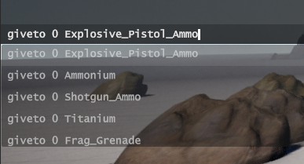
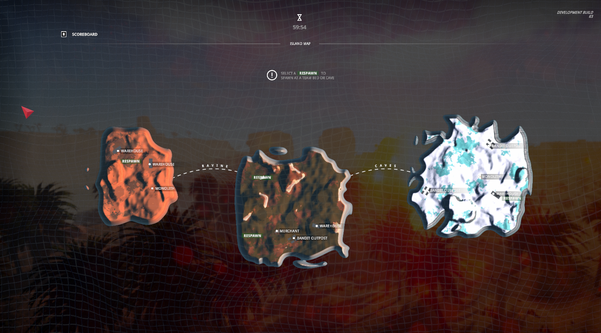
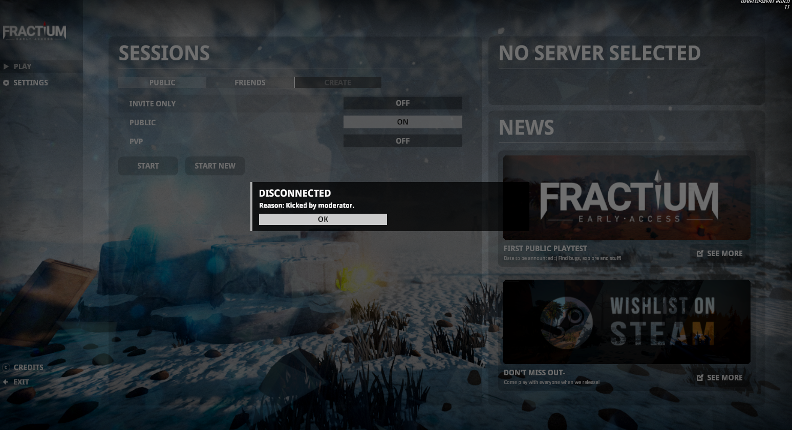
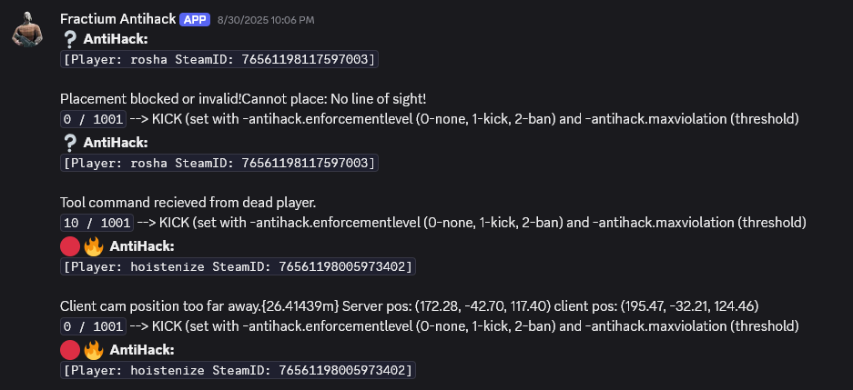

# Devblog 2

Got less done than we wanted, but steady progress continues.

### SUCCESSFUL STRESS TEST
*by Aaron*

We ran a smooth test with **800 items** (with rigidbodies), **250 NPCs** (aggro'd), and **25 player connections**. Next, with 250 players. 

The goal is to prove systems scale, and so far, everything has worked flawlessly. Feels good to verify years of work and optimizations. 

#### How the test works:
I wrote a script that runs headless clients in parallel, which maxed my CPU usage at 25 connections. That's 25 700x700m terrains and player loops running on a single computer. I also joined on my laptop with graphics enabled to check worst case player perf. Frame rates did drop with over a few hundred enemies on screen, but that won't be happening realistically. 

Next, we’ll rent machines to aim for 250 players. The server held up great—only slowing past 300 NPCs, which is fine since NPC loops are server-heavy and 300 is worst worst case.

It looked suitably chaotic, we'll share some footage soon.

#### Implemented
✔️ move, sprint, jump, crouch, shoot, melee, reload 
✔️ receive loot   
✔️ text chat 

#### In progress
spam transfer loot slots  ◦ voice chat   ◦ open chests, craft, build  ◦ rocket building destruction  ◦ loot spill  ◦ crowded/dispersed groups  ◦ PvP  ◦ all of above on flatworld & procedural  

### ROCKS
*by Rylan*

Something cool here with a screenshot?

### F1 CONSOLE
*by Aaron*

F1 console got a revamp:  
◦ Startup args now double as console commands  
◦ More commands
◦ Dynamic auto-completions:

### WORLD GEN

Fractium will have a 3 islands you can travel between. This is what that looks like at the moment in our UI (we want fog of war on the map eventually, though):

Unlike Minecraft/Rust, and unlike 2 weeks ago, islands now only generate **from the seed** on the server/host. The clients recieve the raw terrain and rock placements rather than trying to generate the same exact way as the server. This is good for avoiding consistency issues, but upsetting for those who make those cinematic replays and expect the seed to look the same way every time.

Rylan also noticed that the terrain may not be capturing the detail generated by the heightmap. For example, our 3D terrains don't seem to have the sand dunes you can cearly see in this texture. This is something we are tracking now for a future investigation.

### ANTI-HACK IMPROVEMENTS
Updates include:  
◦ Configurable enforcement (kick/ban)  
◦ Violation thresholds & decay  
◦ Discord alerts  
◦ Pop-up explaining kicks:

We tested the server-side validation ourselves and can see it working, kicking players past a violation threshold, and notifying Discord with each violation.

### NEW WEBSITE
Before, I was using a Wordpress template. Now, we're using something arguably worse: raw HTML, CSS, and Javascript.

Soon, this will host a wiki and convienant documentation for server owners. All pages on this website are generated from markdown and GitHub pushes auto-deploy are reflected automatically; it's pretty efficient.

### OTHER WORK
We’ve found lots of bugs (**at least 41** total so far) and are talking about a different art style possibly.

### WHAT'S NEXT
◦ More stress tests  
◦ Finish EAC integration  
◦ Bug fixes 

## CHANGELOG

**8/24/2025**
◦ Startup args double as console commands  
◦ Added `forceislandbiome`, `forceislandseed`, `togglesteamauth`  
◦ Fixed mid-air spawn bug (procedural vs flatworld)  
◦ Fixed respawn input lock with map open  
◦ Inventory now auto-closes on death  
◦ Fixed `F3 revive` teleport bug  
◦ Disabled TEAM chat  
◦ Fixed black name color in chat  

**8/25/2025**
◦ Smoothed ladder climb, limited horizontal velocity  
◦ Combat logs sent only to involved players  
◦ Added `kit` admin command (pistol & ammo)  
◦ Fixed voice chat to use 3D audio  
◦ Finalized P2P transport for Unity editor playmode (`UNITY_SERVER`)  
◦ Improved voice volume rolloff & proximity networking  

**8/26/2025**
◦ Fixed worldgen indeterminism (server-only, sent as `byte[]`)  

**8/27/2025**
◦ Improved anti-hack logging on melee LOS  
◦ Console spawn menu now uses look direction  
◦ Added server args: `antihack.enforcementlevel` (kick/ban), `antihack.maxviolation` (threshold), Discord alerts  

**8/28/2025**
◦ First stress test with 25 players  

**8/29/2025**
◦ Stress test: 250+ NPCs, 3 players, 800 items, full stability  

**8/30/2025**
◦ Added violation score decay (`-antihackdecaypermin`, default 50)  
◦ Anti-hack bypassed when cheats enabled  

**9/1/2025**
◦ Added `giveto`, `giveall`, `give` (with `steamID itemName quantity` args)  
◦ Added `listplayers`  
◦ Autocompletions for dynamic args (steamID, itemName)  
◦ Added `teleport` to player  
◦ Added `usage` for command help  
◦ Attacking cancels gradual healing buffs  
◦ Pop-up shows kick reason  
◦ Added streamer mode to hide session name

**9/2/2025**
◦ Added resolution selector in settings

**9/3/2025**
◦ Made a landing page and revamped the old blog

**9/4/2025-9/7/2025**
◦ Wrapped up this website
