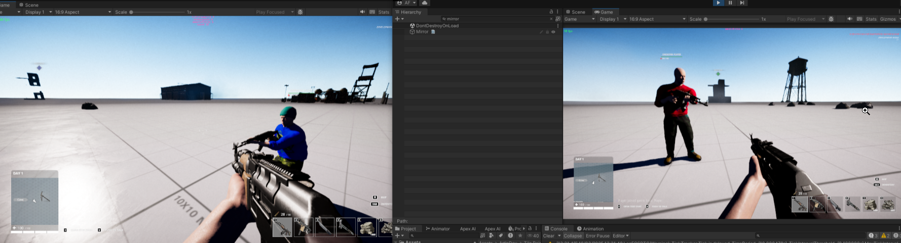
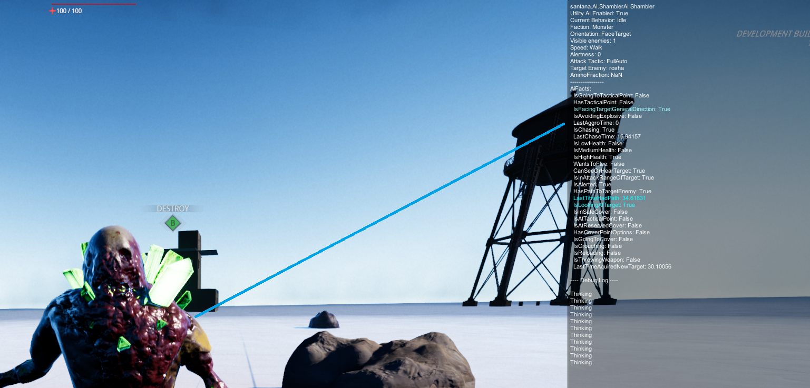

# Devblog 3

Bug fixes, commands, & antihack

### Going Full-Time
*by Aaron*

Big news: After two years at Blizzard as a SWE, I've resigned! Now, I can focus on Fractium full-time. 

This update covers the past two weeks of critical bug fixes, security improvements, and quality-of-life features. It's lighter than usual since I've been juggling the career transition and moving apartments, but momentum is building now that life is stabilizing.

 
### Cinema Camera

There is a console command `freecam` that server admins can use to noclip around the world.

In this update I added cinematic camera shake, entity tracking with projected velocity, and a lot of other controls. We'll use this to make trailers, eventually.

### Bug Bash

Fixed **20 bugs** this update, bringing us down to just **21 total** with only **1 critical** remaining.

Bugs come out of all cracks and crevices because our systems need to work flawlessly across many contexts:
* **Editor vs. Standalone** - Development tools vs. final game builds
* **Network Types** - Steam P2P, dedicated servers, and local play
* **World Types** - Procedural generation vs. hand-crafted test worlds  
* **Player Contexts** - Local, remote, and host players all behave differently

Each combination creates unique challenges. For example, this week I discovered our networking library executes callbacks in different orders between editor and builds—subtle things like this break multiplayer in unexpected ways that are hard to track down.

I also tackled a nasty managed stripping bug that only affected release builds, where the compiler was removing AI code it thought was "unused" (but was actually accessed through reflection).

The goal moving forward: **zero critical bugs**. I've also improved our development workflow with ParrelSync, letting me test multiplayer scenarios solo with hot reload.

### Movement Antihack

I've built server-side validation for player movement that checks:
* **Groundedness** - Prevents fly hacking and impossible jumps
* **Speed limits** - Catches speed hackers moving too fast
* **Collision detection** - Stops noclip cheats that phase through walls

I tested these by simulating clientside cheats. The validation works, detection works, and will flag players accordingly. This integrates with the violation scoring system from the previous update, so admins can tally violations and manage enforcement.

### More Console Commands

◦ `-fresh` - for dedicated servers, forces new world data 
◦ `listbannedplayers` - prints list of banned users to console
◦ `listadmins` - prints list of admins to console
◦ `clearviolations` - clears antihack violation scores for all players
◦ `connect` - connects to a server by IP without using the server browser

### Entity Debugger

If you are an admin in a dev build you can press H to get a debug view of entities.

### What's Next

Now that I'm full-time and the critical bugs are under control, expect some momentum:
* **Stress testing** - Pushing toward 250+ concurrent players
* **New content** - A really cool base building mechanic, and potentially a classic roguelike gamemode
* **World gen** - We found a way to integrate the original tile system with the proc-gen islands

## CHANGELOG

**9/28/2025**
◦ Added debugging overlay for cinematic / free camera  
◦ Smoothed cinematic camera movements  
◦ Cinematic camera shake strength control  
◦ Added speed controls for cinematic / free camera  
◦ Refactored console command system for streamlined admin checking & execution context validation  

**9/29/2025**
◦ Entity tracking and DoF using ctrl + scroll  
◦ Added a temporary soundtrack and soundtrack system  

**10/1/2025**
◦ Added more security logging  
◦ Refactored some networking code for readability  
◦ Removed purple fog that was floating around in the sky  
◦ Ensure clients don't begin island gen until server finishes  
◦ Added "find text in scene" tool  
◦ Fixed input hint bugs - a layout issue and it now shows C - CONSUME instead of default for medkit  

**10/2/2025**
◦ Restored some missing AI stat data causing enemies to idle  
◦ Add cons. cmd to connect to server by IP  
◦ Fixed certain projectiles like rockets not spawning when created by non-local players  

**10/3/2025**
◦ Reduced player knockback which was 10x too high  
◦ Fixed occasionally invisible settings button from UI tween issue  
◦ Add connection timeout popup instead of only logging error  
◦ Fixed local host networking so ParrelSync now works correctly  
◦ Don't show XP popup anymore. we don't have an XP system.  
◦ Fixed player floating above corpse during respawn  
◦ Fixed player visible before being alive on first spawn in  
◦ Fixed player footstep sounds not broadcasting to remote clients  

**10/4/2025**
◦ Fixed door sound distance which was too high  
◦ Client timeout w/popup if server world generation does not complete in 15s  
◦ Prevent joining games with version mismatch  
◦ Add -fresh command line argument to force new world data for dedicated servers  
◦ Add listbannedplayers server-only console command to show a list of banned players  
◦ Add listadmins server-only console command to show a list of admins/mods  
◦ Add console command to reset antihack: clearviolations  
◦ Created a popup warning user if machine is not connected to the internet when they refresh server browser  
◦ Add console command to list violation scores for each player "listviolations"  
◦ Added serverside fly hack protection  
◦ Added serverside speed hack protection  
◦ Added serverside noclip hack protection  
◦ Tested all three with simulated clientside "hacks"  

**10/6/2025**
◦ Show server age in browser and pause GUI  
◦ Remove player body decals like blood on respawn  
◦ Fixed movement interpolation for rendering remote players who have low FPS  
◦ Ensure weapon flashlight is centered/aligned with camera for local player  
◦ Fixed oversized casing shells ejected on player world pistol  

**10/7/2025**
◦ Fixed UI initialization issues on standalone build  
◦ Added a debug view mode for development builds (hold H while looking at entity)  

**10/8/2025**
◦ Fixed bug with managed stripping preventing AI from loading due to assembly types only referenced via reflection