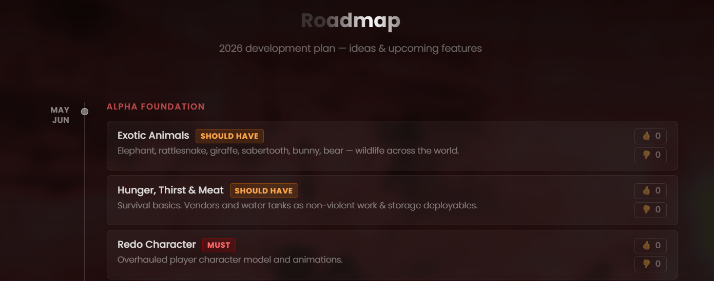
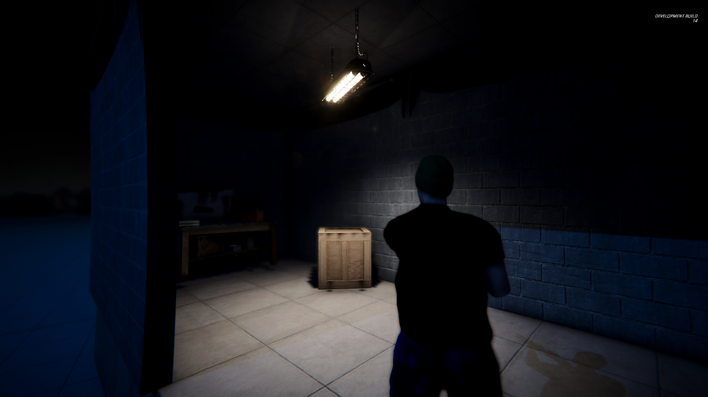
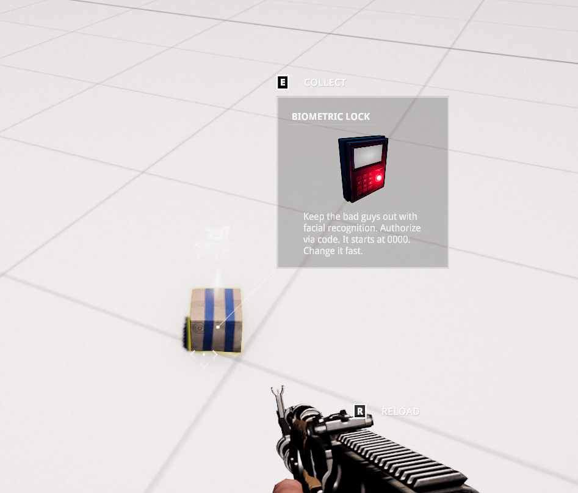
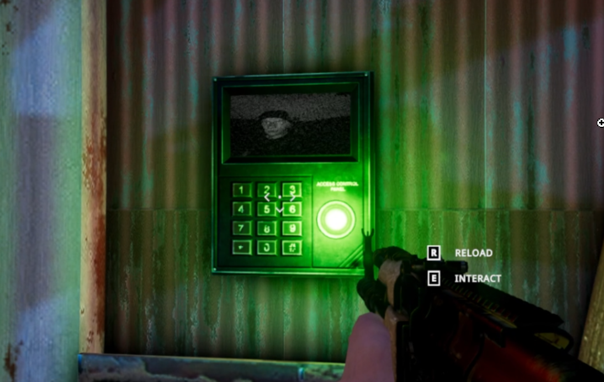
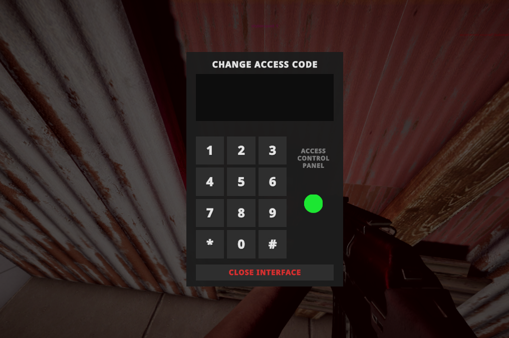
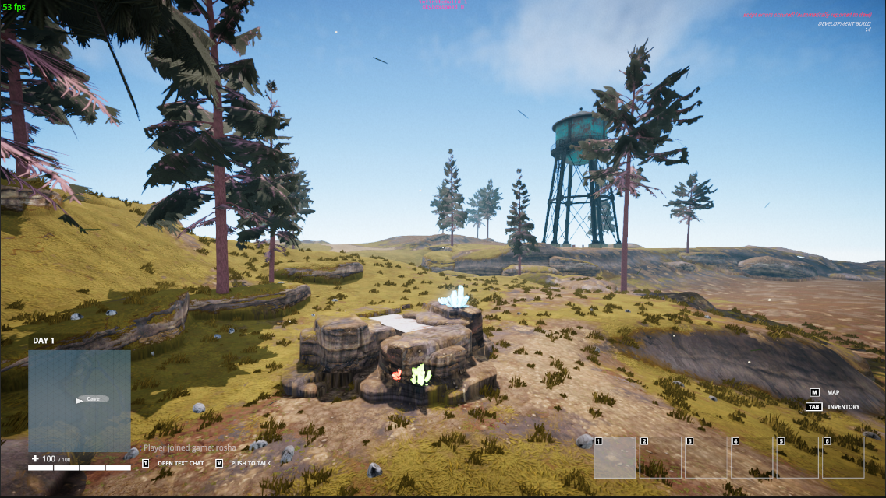
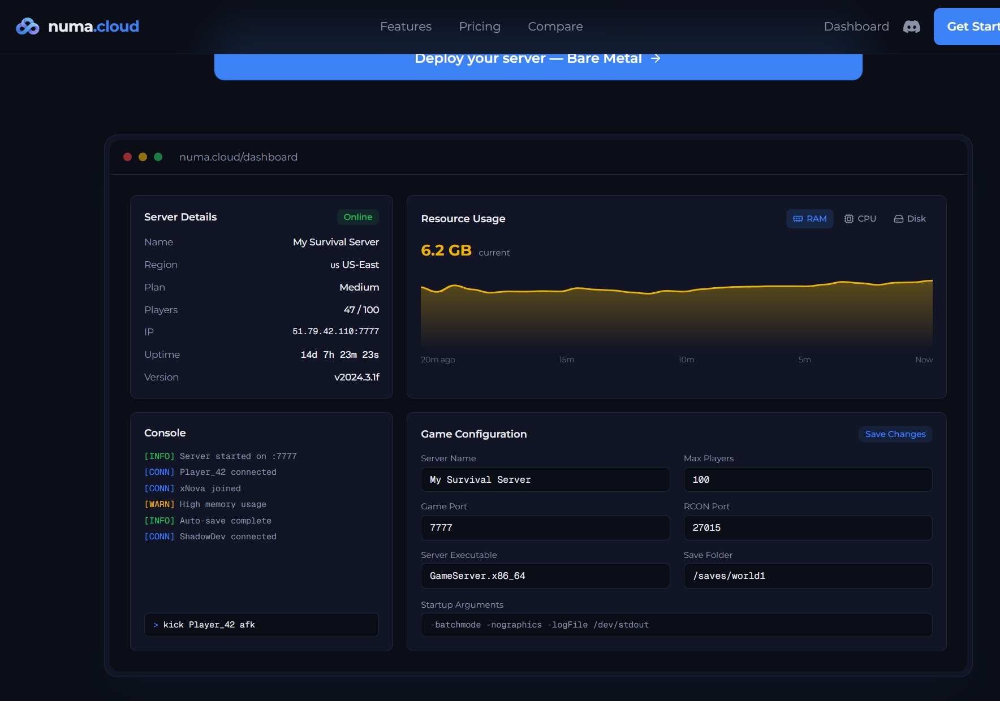

# Devblog 4

Two new deployables. Zero bugs. One click world deployment.

### Your Vote Matters

Please vote on what you like / dislike on our new roadmap! This is a systems based survival game. 

At the moment, I just tossed all my ideas into Claude, and it gave me this timeline. So, things will look a lot different soon as we actually begin to plan things.

[Check it out here](https://www.twoloop.net/?page=roadmap).

### 💡 New Deployable: Ceiling Lamp

The first new deployable is the **Ceiling Lamp** — you'll probably want some lighting once we make it properly dark inside the bases.

We just use a few raycasts to ensure both supports are touching the ceiling. 

<iframe width="100%" height="315" src="https://www.youtube.com/embed/qJlYEJp2gWI?enablejsapi=1&controls=0&loop=1&playlist=qJlYEJp2gWI" frameborder="0" allow="accelerometer; autoplay; clipboard-write; encrypted-media; gyroscope; picture-in-picture" allowfullscreen style="border-radius:8px;box-shadow:0 4px 16px rgba(0,0,0,0.2);"></iframe>

Shipping a deployable to this standard involves more than it looks:
* Item (inventory, world pickup, health, etc.)
* Deployable logic (placement, structural dependency)
* LODs
* Sounds (looping hum + on/off switch)
* Networking & interaction (server authoritative)
* State serialization (save/load persistence)

### 🔐 New Deployable: Biometric Code Lock

The second new deployable is the **Biometric Code Lock** — a door-mounted device that combines a live facial recognition feed with a numeric access code.

<iframe width="100%" height="315" src="https://www.youtube.com/embed/4d8Q1PWoOBI?enablejsapi=1&controls=0&loop=1&playlist=4d8Q1PWoOBI" frameborder="0" allow="accelerometer; autoplay; clipboard-write; encrypted-media; gyroscope; picture-in-picture" allowfullscreen style="border-radius:8px;box-shadow:0 4px 16px rgba(0,0,0,0.2);"></iframe>

When an authorized player looks at the lock, the light turns green, and that side of the door unlocks for all players.

To authorize yourself, just type in the code. It initializes to `0000` — so change it fast:

Same story under the hood, plus a few extras:
* Item (inventory, world pickup, health, etc.)
* Deployable logic (placement, structural dependency)
* LODs
* Sounds (looping hum + on/off switch)
* Networking & interaction (server authoritative & validated)
* State serialization (save/load persistence)
* Custom CCTV shader (render texture feed on the panel display)

### 🏗️ Making Game Servers
*by Aaron*

For years, I was concerned about how we'd manage a fleet of dedicated gameservers: Keeping infastructure in sync, scaling up, and managing each.

So I built a one-click pipeline that works with any Unity game to:
- purchase and configure baremetal infastructure
- install game builds and orchestrate a fleet (easy scale up/down)
- manage survival game lifecycle via one panel (wipes, RCON, save rollbacks, in-game observability, etc.)

This is almost done. Players will also get access.

It's called numa.cloud, and should work with any Unity game:

### 🏗️ Item Wiki 

Now it gets **generated directly from game source files**.

### Bug Bash — Bugs Hit Zero

I fixed a ton of bugs and general issues, like resolution scaling. 

Main Learnings:
- "Aspect Ratio Fitter" component makes resolution scaling easier than I thought
- You should ALWAYS consider using Physics.SyncTransforms before doing any sort of collision checks, like spherecasting, spherecheck, etc., otherwise, it can't really be trusted to be up to date, especially if you are depending on positional data for deterministic initialization, or something like that (we were, which might actually be it's own code smell).

## CHANGELOG

**10/13/2025**

* 🐛 Fixed hitmarker starting visible when joining as a non-host

**12/9/2025**

* 🐛 Removed motion blur setting — doesn't interact cleanly with scope and screen effects

**12/15/2025**

* 🐛 Fixed dead player appearing as standing character instead of ragdoll/invisible when joining a session

**4/8/2026**

* 🐛 NPCs are now always upright, no longer matching terrain slopes
* 🐛 Build stripper now does proper cleanup on asset folders
* 🐛 Fixed NPCs not facing heading direction while navigating to a threat point

**4/10/2026**

* 🐛 Smoothed hipfire-to-ADS camera transition; less jarring

**4/11/2026**

* 🐛 Fixed bug where other players' projectiles spawned from the wrong gun endpoint

**4/12/2026**

* 🐛 Fixed forest being too bright during daytime
* 🐛 Fixed corrupted vegetation system and conditional rendering issue
* 🐛 Reduced massive scale of new forest tree models
* 🐛 Fixed overly pale skin tones

**4/21/2026**

* ⭐ Item wiki and console command wiki now built automatically from game files

**4/22/2026**

* 🐛 Fixed hitmarker starting visible in build
* 🐛 Fixed crosshair appearing when closing inventory without a weapon equipped
* 🐛 Fixed pointer appearing black instead of white in standalone build
* 🐛 Fixed: closing and reopening the menu too quickly could prevent it from reopening
* 🐛 Resolution scaling now works for persistent menu and loading screen

**4/23/2026**

* 🐛 Resolution scaling fixed on F1 console / spawn menu UI
* 🐛 Resolution scaling fixed on HUD UI
* 🐛 Resolution scaling fixed on inventory UI
* 🐛 Fixed more UI tweening determinism issues
* **BUGS AT ZERO 🎊**

**4/25/2026**

* 🐛 Fixed hotbar select bug using number keys
* ⭐ Finished new ceiling lamp deployable — it's in the game
* 🐛 Fixed "RATE" showing incorrectly for deployables in the hover inspector

**4/27/2026**

* 🐛 Fixed deployable placement bounds validation bug
* 🐛 Turret deployable now correctly indicates its placement direction

**4/29/2026**

* ⭐ New deployable: biometric code lock complete
